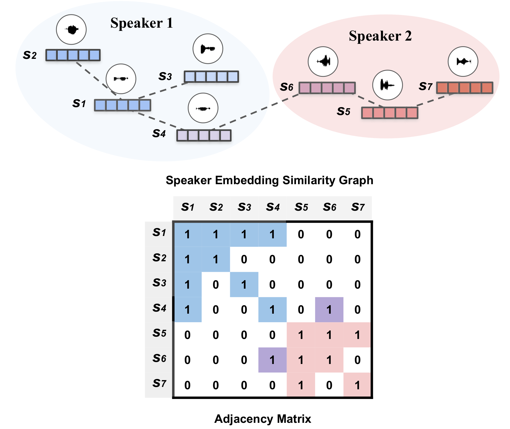
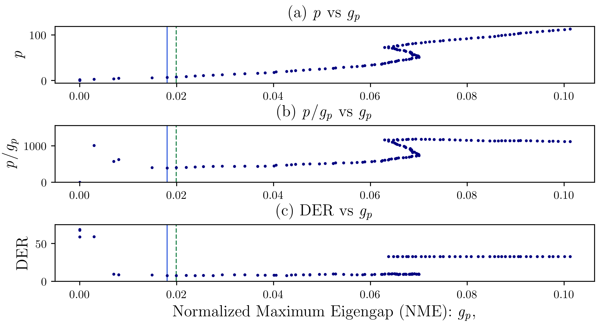

# Auto Tuning Spectral Clustering for SpeakerDiarization Using Normalized Maximum Eigengap


  

* Code for the IEEE Signal Processing Letters (SPL) paper ["Auto-Tuning Spectral Clustering for SpeakerDiarization Using Normalized Maximum Eigengap"](https://drive.google.com/file/d/1CdEJPrpW6pRCObrppcZnw0_hRwWIHxi8/view?usp=sharing)
* Spectral Clustering with auto tuning approach for speaker diarization tasks.
* Based on Kaldi binaries, python and bash script 

## Getting Started

### TLDR; One-click demo script

* [**virtualenv**](https://docs.python-guide.org/dev/virtualenvs/) should be installed on your machine.
* _run_demo_clustering.sh_ installs a virtualenv and runs spectral a clustering example.
* This script runs two utterances from [CALLHOME](https://catalog.ldc.upenn.edu/LDC2001S97) dataset with precomputed segment files and affinity matrices in ./sample_CH_xvector folder.

```bash
source run_demo_clustering.sh
```
### Prerequisites

* This repo is based on python 3.7.
* The mainly required python3 libraries:
```
joblib==0.14.0
numpy==1.17.4
scikit-learn==0.22
scipy==1.3.3
kaldi_io==0.9.1
```
* [Kaldi](https://kaldi-asr.org/doc/about.html) is required to reproduce the numbers in the paper. Go to [Kaldi install](http://jrmeyer.github.io/asr/2016/01/26/Installing-Kaldi.html) to install Kaldi software.
* [Kaldi](https://kaldi-asr.org/doc/about.html) should  be installed in your home folder `~/kaldi` to be successfully loaded.
* You can still run the clustering algorithm without [Kaldi](http://jrmeyer.github.io/asr/2016/01/26/Installing-Kaldi.html) by saving your affinity matrix into .npy.

### Installing

You have to first have [**virtualenv**](https://docs.python-guide.org/dev/virtualenvs/) installed on your machine. Install [**virtualenv**](https://docs.python-guide.org/dev/virtualenvs/) with the following command:
```
sudo pip3 install virtualenv 
```
If you installed virtualenv, run the "install_venv.sh" script to make a virtual-env.
```
source install_venv.sh
```
This command will create a folder named "env_nmesc".


### Usage Example

You need to prepare the followings:

1. **Segmentation files** in Kaldi style format:  
<segment_id> <utt_id> <start_time> <end_time>

ex) segments
```
iaaa-00000-00327-00000000-00000150 iaaa 0 1.5
iaaa-00000-00327-00000075-00000225 iaaa 0.75 2.25
iaaa-00000-00327-00000150-00000300 iaaa 1.5 3
...
iafq-00000-00272-00000000-00000150 iafq 0 1.5
iafq-00000-00272-00000075-00000225 iafq 0.75 2.25
iafq-00000-00272-00000150-00000272 iafq 1.5 2.72
```
3. **Affinity matrix files** in Kaldi scp/ark format: Each affinity matrix file should be N by N square matrix.
2. **Speaker embedding files** (optional): If you don't have affinity matrix, you can calculate cosine similarity ark files using _./sc_utils/score_embedding.sh_ 

#### Running the python code with arguments:
```bash
python spectral_opt.py --distance_score_file $DISTANCE_SCORE_FILE \
                       --threshold $threshold \
                       --score-metric $score_metric \
                       --max_speaker $max_speaker \
                       --spt_est_thres $spt_est_thres \
                       --segment_file_input_path $SEGMENT_FILE_INPUT_PATH \
                       --spk_labels_out_path $SPK_LABELS_OUT_PATH \
                       --reco2num_spk $reco2num_spk 
```

#### Arguments:

* **distance_score_file**: A list of affinity matrix files.  
```
# If you want to use kaldi .ark score file as an affinity matrix
DISTANCE_SCORE_FILE=$PWD/sample_CH_xvector/cos_scores/scores.scp

# If you want to use .npy numpy file as an affinity matrix
DISTANCE_SCORE_FILE=$PWD/sample_CH_xvector/cos_scores/scores.txt
```
Two options are available:  

(1) scores.scp: Kaldi style scp file that contains the absolute path to .ark files and its binary address. Space separted \<utt_id\> and \<path\>.

ex) scores.scp
```
iaaa /path/sample_CH_xvector/cos_scores/scores.1.ark:5
iafq /path/sample_CH_xvector/cos_scores/scores.1.ark:23129
...
```

(2) scores.txt: List of <utt_id> and the absolute path to .npy files.  
ex) scores.txt
```
iaaa /path/sample_CH_xvector/cos_scores/iaaa.npy
iafq /path/sample_CH_xvector/cos_scores/iafq.npy
...
```
* **score-metric**: Use 'cos' to apply for affinity matrix based on cosine similarity.  
ex) 
```bash
score_metric='cos'
```

* **max_speaker**: If you do not provide oracle number of speakers (reco2num_spk), the estimated number of speakers is capped by _max_speaker_. Default is 8.
```bash
max_speaker=8
```
* **threshold**: Manually setup a threshold. We apply this threshold for all utterances. This should be setup in conjuction with **spt_est_thres**.
ex) 
```bash
threshold=0.05
```

* **spt_est_thres**:
spt_est_thres $spt_est_thres \
```bash
# You can specify a threshold.
spt_est_thres='None'
threshold=0.05 

# Or you can use NMESC in the paper to estimate the threshold.
spt_est_thres='NMESC'
threshold='None'

# Or you can specify different threshold for each utterance.
spt_est_thres="thres_utts.txt"
threshold='None'
```
thres_utts.txt has a format as follows:
<utt_id> <threshold>  
  
ex) thres_utts.txt
```
iaaa 0.105
iafq 0.215
...
```

* **segment_file_input_path**: "segments" file in Kaldi format. This file is also necessary for making rttm file and calculating DER.
```bash
segment_file_input_path=$PWD/sample_CH_xvector/xvector_embeddings/segments
```
ex) segments
```
iaaa-00000-00327-00000000-00000150 iaaa 0 1.5
iaaa-00000-00327-00000075-00000225 iaaa 0.75 2.25
iaaa-00000-00327-00000150-00000300 iaaa 1.5 3
...
iafq-00000-00272-00000000-00000150 iafq 0 1.5
iafq-00000-00272-00000075-00000225 iafq 0.75 2.25
iafq-00000-00272-00000150-00000272 iafq 1.5 2.72
```

* **reco2num_spk**: A list of oracle number of speakers. Default is 'None'.
reco2num_spk $reco2num_spk
```bash
reco2num_spk='None'
reco2num_spk='oracle_num_of_spk.txt'
```
In the text file, you must include <utt_id> and <oracle_number_of_speakers>   
ex) oracle_num_of_spk.txt
```
iaaa 2
iafq 2
iabe 4
iadf 6
...
```

### Cosine similarity calculator script

#### Running the python code for cosine similarity calculation:
```
data_dir=$PWD/sample_CH_xvector
pushd $PWD/sc_utils
text_yellow_info "Starting Script: affinity_score.py"
./score_embedding.sh --cmd "run.pl --mem 5G" \
                     --score-metric $score_metric \
                      $data_dir/xvector_embeddings \
                      $data_dir/cos_scores 
popd
```
* **cmd**: This is for following the kaldi style argument.
* **score-metric**: Should be 'cos' for cosine similarity.
```
score_metric='cos'
```
* **\<src-embedding-dir\>**: Source embedding directory where xvector.scp and xvector.ark files are
* **\<out-dir\>**: Output directory. This script will create scores.1.ark file and scores.scp


### Expected output result of one-click script

```bash
$ source run_demo_clustering.sh 
=== [INFO] The python_envfolder exists: /.../Auto-Tuning-Spectral-Clustering/env_nmesc 
=== [INFO] Cosine similariy scores exist: /.../Auto-Tuning-Spectral-Clustering/sample_CH_xvector/cos_scores 
=== [INFO] Running Spectral Clustering with .npy input... 
=== [INFO] .scp file and .ark files were provided
Scanning eig_ratio of length [19] mat size [76] ...
1  score_metric: cos  affinity matrix pruning - threshold: 0.105  key: iaaa Est # spk: 2  Max # spk: 8  MAT size :  (76, 76)
Scanning eig_ratio of length [15] mat size [62] ...
2  score_metric: cos  affinity matrix pruning - threshold: 0.194  key: iafq Est # spk: 2  Max # spk: 8  MAT size :  (62, 62)
Method: Spectral Clustering has been finished 
=== [INFO] Computing RTTM 
=== [INFO] RTTM calculation was successful. 
=== [INFO] NMESC auto-tuning | Total Err. (DER) -[ 0.32 % ] Speaker Err. [ 0.32 % ] 
=== [INFO] .scp file and .ark files were provided
1  score_metric: cos  affinity matrix pruning - threshold: 0.050  key: iaaa Est # spk: 2  Max # spk: 8  MAT size :  (76, 76)
2  score_metric: cos  affinity matrix pruning - threshold: 0.050  key: iafq Est # spk: 5  Max # spk: 8  MAT size :  (62, 62)
Method: Spectral Clustering has been finished 
=== [INFO] Computing RTTM 
=== [INFO] RTTM calculation was successful. 
=== [INFO] Threshold 0.05 | Total Err. (DER) -[ 20.57 % ] Speaker Err. [ 20.57 % ] 
Loading reco2num_spk file:  reco2num_spk
=== [INFO] .scp file and .ark files were provided
1  score_metric: cos  Rank based pruning - RP threshold: 0.0500  key: iaaa  Given Number of Speakers (reco2num_spk): 2  MAT size :  (76, 76)
2  score_metric: cos  Rank based pruning - RP threshold: 0.0500  key: iafq  Given Number of Speakers (reco2num_spk): 2  MAT size :  (62, 62)
Method: Spectral Clustering has been finished 
=== [INFO] Computing RTTM 
=== [INFO] RTTM calculation was successful. 
=== [INFO] Known Num. Spk. | Total Err. (DER) -[ 0.15 % ] Speaker Err. [ 0.15 % ] 

```

## Authors

Tae Jin Park: taejinpa@usc.edu, tango4j@gmail.com  
Kyu J.  
Manoj Kumar   
Shrikanth Narayanan   
